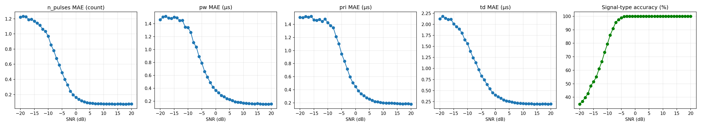

# Investigating AI-Based Radar Signal Characterisation from Raw I/Q Data

*A self-directed learning project.*

A learning project on **radar signal characterisation**: a single 1D
convolutional neural network that, from raw I/Q data, predicts a radar signal's
**type** *and* estimates its four pulse parameters (number of pulses, pulse
width, PRI, time delay) — the full RadChar task — benchmarked against the
published RadChar results.

I built this to learn two things at once — **how radar signals actually work**
(pulses, I/Q, modulation schemes, SNR) and **how to combine radar with deep
learning** on raw signal data rather than hand-crafted features. The direction
was inspired by a similar project on *bistatic* radar data at a Swedish defence
company; I didn't have access to bistatic data, so I used the open **RadChar**
dataset of monostatic pulsed-radar signals instead. It's purely educational.

## What the project does

- **Explores** the RadChar dataset and what raw radar I/Q looks like (notebooks 01–02).
- **Trains `RadarMTL`** — one shared 1D-CNN backbone feeding five heads: one
  classification head (signal type) and four regression heads (the pulse
  parameters), on raw I/Q (notebook 03 + `radar.model`).
- **Benchmarks** the model against the published RadChar Table 1 (classification
  accuracy *and* regression MAE) across SNR, and reproduces its Fig. 3 curves
  (notebook 04).

## The model

`RadarMTL` is a multi-task network: a shared convolutional backbone (3 conv
blocks, 2 → 32 → 64 → 128 channels, adaptive average pool → 128-dim features)
branches into five heads that together form the **Pulse Descriptor Word** —
signal type plus number of pulses, pulse width, PRI and time delay. It is trained
with cross-entropy on the class head and L1 loss on each regression head,
combined as a weighted sum (the paper's recipe).

## Results

Evaluated on the held-out test set. Reference values are the RadChar paper's
reported figures ([arXiv:2306.13105](https://arxiv.org/abs/2306.13105)). The paper's
four models are CNN1D / CNN2D (the paper's plain-CNN baselines) and IQST-S / IQST-L
(its transformers — the headline models). Ours is a 1D CNN, closest in spirit to CNN1D.

My goal was understanding radar and multi-task learning, not topping the leaderboard
— but the full benchmark is here for anyone interested.

**Classification accuracy by SNR** (higher is better; bold = best of all five).

| Model | −10 dB | 0 dB | +10 dB |
|-------|--------|------|--------|
| CNN1D (RadChar paper) | 0.757 | 0.998 | 1.000 |
| CNN2D (RadChar paper) | 0.673 | 0.983 | 0.998 |
| IQST-S (RadChar paper) | 0.792 | 0.999 | 1.000 |
| IQST-L (RadChar paper) | 0.791 | 0.998 | 1.000 |
| **This project (`RadarMTL`)** | **0.794** | **1.000** | 1.000 |

**Regression MAE by SNR** (lower is better). Number of pulses is a count; pulse
width / PRI / time delay are in microseconds. Bold marks where `RadarMTL` is the
best of all five models for that parameter and SNR.

| Task | Model | −10 dB | 0 dB | +10 dB |
|------|-------|--------|------|--------|
| number of pulses | CNN1D (paper) | 0.729 | 0.193 | 0.085 |
| | CNN2D (paper) | 0.793 | 0.174 | 0.090 |
| | IQST-S (paper) | 0.733 | 0.294 | 0.251 |
| | IQST-L (paper) | 0.752 | 0.195 | 0.124 |
| | **`RadarMTL` (ours)** | 0.971 | **0.162** | **0.077** |
| pulse width (µs) | CNN1D (paper) | 1.413 | 0.560 | 0.340 |
| | CNN2D (paper) | 1.466 | 0.801 | 0.505 |
| | IQST-S (paper) | 1.282 | 0.628 | 0.364 |
| | IQST-L (paper) | 1.253 | 0.579 | 0.334 |
| | **`RadarMTL` (ours)** | 1.342 | **0.367** | **0.171** |
| PRI (µs) | CNN1D (paper) | 0.999 | 0.330 | 0.209 |
| | CNN2D (paper) | 1.054 | 0.420 | 0.299 |
| | IQST-S (paper) | 0.816 | 0.273 | 0.192 |
| | IQST-L (paper) | 0.799 | 0.286 | 0.225 |
| | **`RadarMTL` (ours)** | 1.427 | 0.448 | 0.200 |
| time delay (µs) | CNN1D (paper) | 1.349 | 0.385 | 0.206 |
| | CNN2D (paper) | 1.729 | 0.638 | 0.443 |
| | IQST-S (paper) | 1.229 | 0.415 | 0.277 |
| | IQST-L (paper) | 1.253 | 0.379 | 0.233 |
| | **`RadarMTL` (ours)** | 1.563 | 0.396 | **0.205** |



Roughly: `RadarMTL` gives the best classification at every SNR, and wins most
regression parameters at moderate-to-high SNR. In heavy noise (−10 dB) the paper's
IQST transformers pull ahead on the timing parameters (PRI, time delay) — attention
seems to handle global pulse timing better than a CNN when the signal is buried in
noise.

## Project structure

- `notebooks/` — the story, 01 (explore) → 04 (benchmark)
- `src/radar/` — reusable code
  - `data.py` — `load_radchar`, `make_split` (deterministic 70/15/15),
    `regression_targets`, `MinMaxNormaliser`
  - `model.py` — `RadarMTL`
- `results/` — trained model, split indices, normaliser stats, plots

## Setup

```bash
pip install -e .
```

Download the RadChar dataset from https://github.com/abcxyzi/RadChar and place
the `.h5` file in `data/` (the data directory is git-ignored). The notebooks
expect `data/RadChar-Baseline.h5`; rename your downloaded file to match, or
edit the `DATA_PATH` constant at the top of each notebook.

Then launch Jupyter and run the notebooks in order:

```bash
jupyter notebook   # run notebooks 01 → 04 in order
```

## Training recipe

Matches the paper's setup (paper §3.1) so the benchmark is fair:

- 70/15/15 train/val/test split, batch size 64, Adam optimiser
- learning rate **5e-4**, up to **100 epochs** with early stopping
- raw I/Q **standardised to the training mean/variance** (fit on train only,
  applied to all splits) — part of the paper's recipe
- regression targets normalised to [0, 1] using **train-set min/max only** (no
  leakage), de-normalised back to real units for MAE reporting
- loss weights `{type: 0.1, n_pulses/pw/pri/td: 0.225}`, exposed as `TASK_WEIGHTS`
- evaluation across the full −20…+20 dB SNR range, reporting the −10 / 0 / +10 dB
  points for Table 1

Training (notebook 03) needs a GPU; the run was done on locally on my GPU.

## What I learned

- **Radar fundamentals from scratch** — what a pulsed radar signal is, how it is
  represented as complex baseband I/Q, and how pulse width, PRI, pulse count and
  time delay shape a waveform.
- **The five RadChar signal classes** — Barker codes, polyphase Barker codes,
  Frank codes, LFM (chirp) pulses, and unmodulated pulse trains — and that each
  has a distinct *frequency fingerprint*.
- **Treating I/Q as a 2-channel sequence** for a 1D CNN, instead of reshaping it
  into an image — keeping the temporal structure of the signal intact.
- **Multi-task learning** — one shared backbone solving classification and
  regression at once, and combining losses on different scales into a single
  weighted objective.
- **Regularisation in practice** — dropout, weight decay, and early stopping, and
  how they trade off training fit against generalisation.
- **Honest evaluation** — a fixed, seeded split saved to disk; the target
  normaliser fit on training data only; the model scored on the identical test
  set with no leakage; and benchmarking against published numbers rather than
  self-reporting.

## Citation

This project uses the **RadChar** dataset and follows the benchmark from its
accompanying paper. Per the dataset authors' request, please cite both the
dataset (https://github.com/abcxyzi/RadChar) and the conference paper:

```bibtex
@inproceedings{huang2023radchar,
  author    = {Zi Huang and Akila Pemasiri and Simon Denman and Clinton Fookes and Terrence Martin},
  title     = {Multi-Task Learning for Radar Signal Characterisation},
  booktitle = {Proceedings of the 2023 IEEE International Conference on Acoustics, Speech, and Signal Processing Workshops (ICASSPW)},
  year      = {2023},
  pages     = {1--5},
  doi       = {10.1109/ICASSPW59220.2023.10193318},
  keywords  = {Modulation, Radar, Speech recognition, Benchmark testing, Multitasking, Transformers, Task analysis, Multi-task learning, Radio signal recognition, Radar signal characterisation, Automatic modulation classification, Radar dataset, Transformer}
}
```
