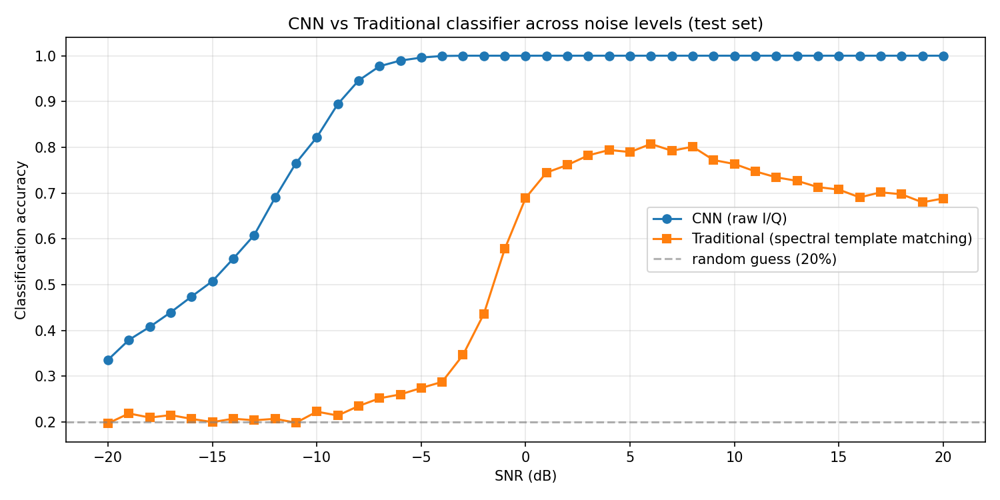

# Radar Signal Classification — DSP Baseline vs 1D CNN

A learning project on **radar signal characterisation**: classifying five radar
signal types directly from raw I/Q data, comparing a traditional DSP baseline
against a small 1D convolutional neural network.

I built this to learn two things at once — **how radar signals actually work**
(pulses, I/Q, modulation schemes, SNR) and **how to combine radar with deep
learning** on raw signal data rather than hand-crafted features. The direction
was inspired by a similar project on *bistatic* radar data at a Swedish defence
company; I didn't have access to bistatic data, so I used the open **RadChar**
dataset of monostatic pulsed-radar signals instead. It's purely educational.

> **Status: work in progress.** The headline numbers below are preliminary and
> will be regenerated on the baseline dataset with the benchmark-aligned setup
> described under *Benchmarking*.

## What the project does

- **Explores** the RadChar dataset and what raw radar I/Q looks like (notebooks 01–02).
- **Builds a traditional DSP baseline** — matched-filter pulse detection and a
  spectral-template classifier, no neural network (notebook 03 + `radar.traditional`).
- **Trains a 1D CNN** on raw I/Q (two channels, I and Q) to classify signal type
  (notebook 04 + `radar.model`).
- **Compares** both methods on the *same* held-out test set, broken down by SNR,
  and benchmarks against the published RadChar results (notebook 05).

## Result (preliminary)

Classification accuracy by SNR, evaluated on the held-out test set. Reference
values are the RadChar paper's reported **classification accuracy**.

| Model | −10 dB | 0 dB | +10 dB |
|-------|--------|------|--------|
| CNN1D (RadChar paper) | 0.757 | 0.998 | 1.000 |
| IQST-S (RadChar paper) | 0.792 | 0.999 | 1.000 |
| IQST-L (RadChar paper) | 0.791 | 0.998 | 1.000 |
| **This project (1D CNN)** | **~0.82** | **~1.00** | **~1.00** |



> Note: this project's `RadarCNN` is a **classification-only** 1D CNN. The paper's
> models are **multi-task** (classification + four regression heads); only the
> classification-accuracy column is compared here. Benchmark source: RadChar
> paper, [arXiv:2306.13105](https://arxiv.org/abs/2306.13105).

## Project structure

- `notebooks/` — the story, 01 (explore) → 05 (compare)
- `src/radar/` — reusable code
  - `data.py` — `load_radchar`, `make_split` (deterministic 70/15/15)
  - `model.py` — `RadarCNN`
  - `traditional.py` — `spectral_feature`, `build_templates`, `classify`
- `results/` — trained model, split indices, plots
- `docs/project_plan.md` — the full project plan

## Setup

```bash
pip install -e .
```

Download the RadChar dataset from https://github.com/abcxyzi/RadChar and place
the `.h5` file in `data/` (the data directory is git-ignored). The notebooks
expect `data/RadChar-Baseline.h5`; rename your downloaded file to match, or
edit the `DATA_PATH` constant at the top of each notebook.

## Benchmarking against the RadChar paper

To compare fairly against the paper's classification results, match their
training setup (paper §3.1):

- 70/15/15 train/val/test split *(already used)*
- batch size 64, Adam optimiser *(already used)*
- learning rate **5e-4**, up to **100 epochs**
- **standardise the raw I/Q to the training-set mean/variance** (fit on train
  only, apply to all splits) — the paper's numbers assume this preprocessing
- evaluate classification accuracy across the full −20…+20 dB SNR range, and
  report the −10 / 0 / +10 dB points

Training (notebook 04) needs a GPU; the final run was done on Kaggle.

## What I learned

- **Radar fundamentals from scratch** — what a pulsed radar signal is, how it is
  represented as complex baseband I/Q, and how pulse width, PRI, pulse count and
  time delay shape a waveform.
- **The five RadChar signal classes** — Barker codes, polyphase Barker codes,
  Frank codes, LFM (chirp) pulses, and unmodulated pulse trains — and that each
  has a distinct *frequency fingerprint*, which is what makes spectral template
  matching possible.
- **Why a DSP baseline matters and where it breaks** — a fixed-threshold matched
  filter and spectral templates work at high SNR but collapse toward chance in
  heavy noise; that failure mode is exactly what motivates the learned model.
- **Treating I/Q as a 2-channel sequence** for a 1D CNN, instead of reshaping it
  into an image — keeping the temporal structure of the signal intact.
- **Regularisation in practice** — dropout, weight decay, and early stopping, and
  how they trade off training fit against generalisation.
- **Honest evaluation** — a fixed, seeded split saved to disk; templates fit on
  training data only; both methods scored on the identical test set with no
  leakage; and benchmarking against published numbers rather than self-reporting.

## Citation

This project uses the **RadChar** dataset and follows the benchmark from its
accompanying paper. Per the dataset authors' request, please cite both the
dataset (https://github.com/abcxyzi/RadChar) and the conference paper:

```bibtex
@inproceedings{huang2023radchar,
  author    = {Zi Huang and Akila Pemasiri and Simon Denman and Clinton Fookes and Terrence Martin},
  title     = {Multi-Task Learning for Radar Signal Characterisation},
  booktitle = {Proceedings of the 2023 IEEE International Conference on Acoustics, Speech, and Signal Processing Workshops (ICASSPW)},
  year      = {2023},
  pages     = {1--5},
  doi       = {10.1109/ICASSPW59220.2023.10193318},
  keywords  = {Modulation, Radar, Speech recognition, Benchmark testing, Multitasking, Transformers, Task analysis, Multi-task learning, Radio signal recognition, Radar signal characterisation, Automatic modulation classification, Radar dataset, Transformer}
}
```
